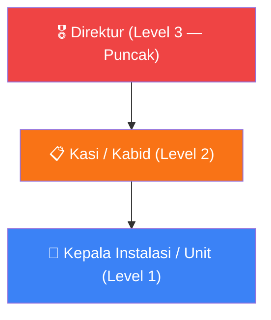
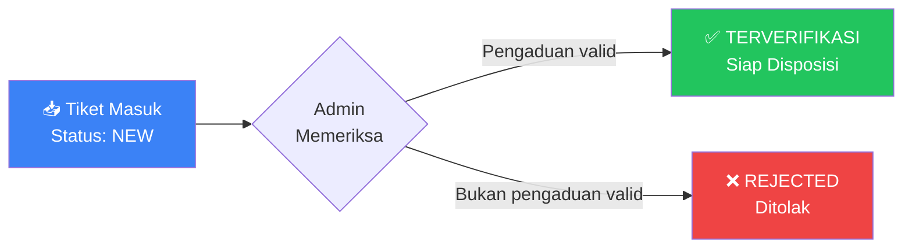
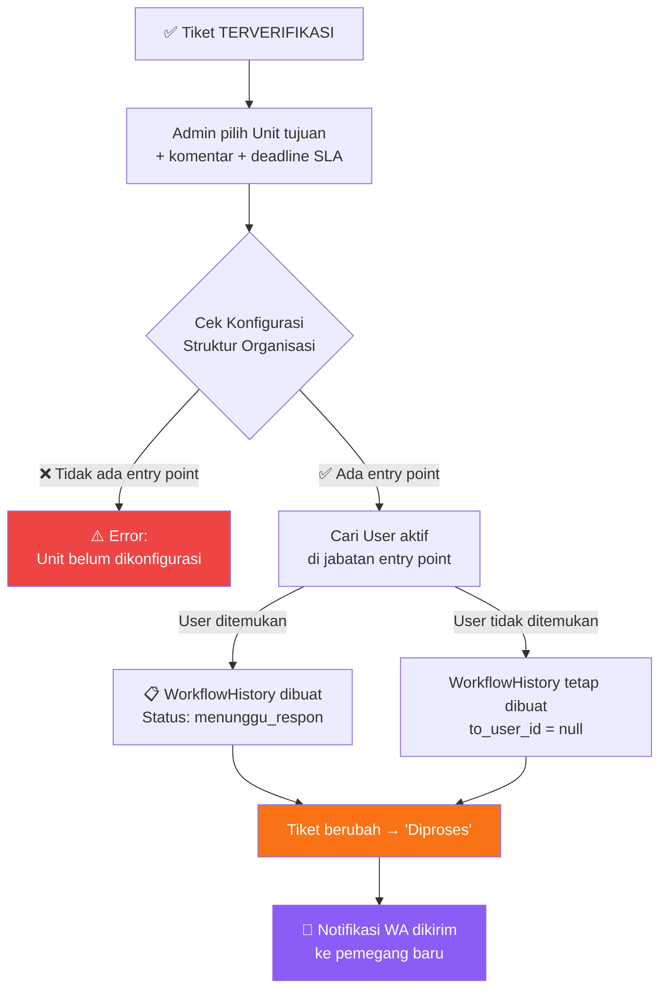
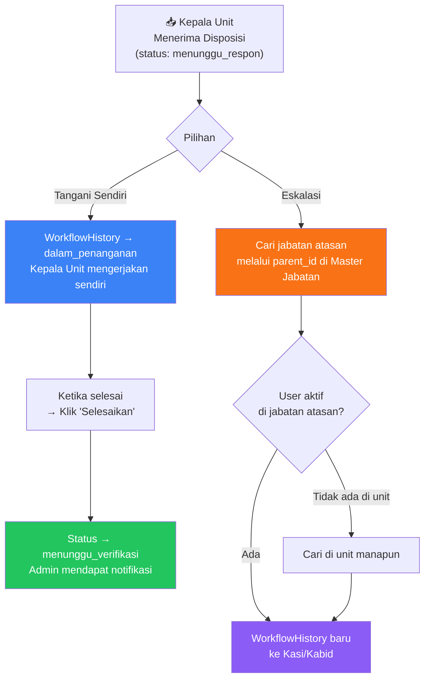
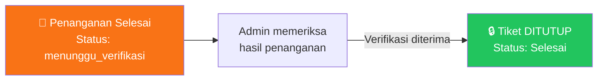
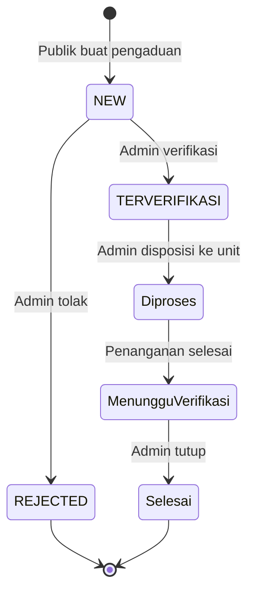

# 🏥 Halo MANAP — Workflow Dashboard Admin
> Panduan lengkap alur kerja dari konfigurasi awal hingga pengelolaan pengaduan oleh Direktur

---

## 📋 Gambaran Umum Sistem

Sistem **Halo MANAP** adalah platform manajemen pengaduan rumah sakit berbasis Laravel. Terdapat hierarki pengguna dengan alur disposisi yang dinamis (tanpa hardcode nama jabatan).

```
PUBLIK → Buat Pengaduan → ADMIN → Verifikasi → Disposisi ke Unit
                                                      ↓
                                             Kepala Unit/Instalasi
                                           ↙ Tangani Sendiri
                                           ↘ Eskalasi ke Kasi/Kabid
                                                      ↓
                                                   Kasi/Kabid
                                           ↙ Tangani Sendiri  
                                           ↘ Eskalasi ke Direktur
                                                      ↓
                                                   DIREKTUR
                                                  (Monitoring)
                                                      ↓
                                          ADMIN → Verifikasi & Tutup
```

---

## 🔑 Peran (Role) dalam Sistem

| Role | Akses Utama | Login URL |
|------|-------------|-----------|
| **Super Admin** | Semua akses, termasuk manajemen sistem | `/dashboard` |
| **Admin Pengaduan** | Kelola tiket, verifikasi, disposisi, tutup tiket | `/dashboard` → `/admin/tickets` |
| **Pegawai** (Kepala Unit/Kasi/Kabid) | Terima disposisi, tangani, atau eskalasi | `/kepala-unit/dashboard` atau `/kasi/dashboard` atau `/kabid/dashboard` |
| **Direktur** | Monitoring semua pengaduan, statistik, audit trail | `/direktur/dashboard` |

---

## 🏗️ FASE 1: Setup Awal (Harus dilakukan sebelum ada pengaduan)

Urutan konfigurasi yang **wajib** dilakukan Admin sebelum sistem dapat digunakan:

```
[1] Buat Master Jabatan
        ↓
[2] Buat Master Unit
        ↓
[3] Konfigurasi Struktur Organisasi (OrganizationHierarchy)
        ↓
[4] Buat Pengguna (Admin, Pegawai, Direktur)
```

---

### 📌 Langkah 1 — Buat Master Jabatan

**URL:** `/admin/jabatans`  
**Controller:** `Admin\JabatanController`

Jabatan distrukturkan dalam **hierarki level** (parent-child). Ini adalah pondasi dari mekanisme eskalasi otomatis.



**Contoh data jabatan (berdasarkan seeder):**

| Level | Nama Jabatan | Kode | Parent |
|-------|-------------|------|--------|
| 3 | Direktur | `JAB_DIREKTUR` | *(tidak ada)* |
| 2 | Kepala Seksi Penunjang Medik | `JAB_KASI_PENUNJANG` | Direktur |
| 1 | Kepala Instalasi | `JAB_KA_INSTALASI` | Kasi |

> [!IMPORTANT]
> **Aturan level jabatan:**
> - **Level 1** = jabatan paling bawah di unit (entry point disposisi)
> - **Level 2** = jabatan menengah (bisa eskalasi ke atasnya)
> - **Level 3** = puncak hierarki (tidak bisa eskalasi lagi, `can_escalate = false`)

**Langkah di UI:**
1. Klik menu **"Master Jabatan"** → Tombol **"Tambah Jabatan"**
2. Isi: **Nama**, **Level** (1/2/3/4), **Parent Jabatan**, **Status**
3. Kode dibuat **otomatis** dari nama jabatan
4. Simpan — buat semua jabatan dari yang paling tinggi ke bawah

---

### 📌 Langkah 2 — Buat Master Unit

**URL:** `/admin/units`  
**Controller:** `Admin\UnitController`

Unit adalah bagian/instalasi/bidang di rumah sakit yang menerima disposisi pengaduan.

**Jenis unit yang tersedia:**
`Instalasi` | `Bidang` | `Bagian` | `Sub Bagian` | `Komite` | `Tim` | `Pelayanan` | `Penunjang` | `Lainnya`

**Contoh struktur unit:**

```
📦 Bidang Pelayanan (parent)
    ├── Instalasi Radiologi
    ├── Instalasi IGD
    └── Instalasi Rawat Inap
```

**Langkah di UI:**
1. Klik menu **"Master Unit"** → Tombol **"Tambah Unit"**
2. Isi: **Kode** (unik), **Nama**, **Jenis**, **Parent Unit** (opsional), **Status**
3. Simpan — buat semua unit yang ada di rumah sakit

---

### 📌 Langkah 3 — Konfigurasi Struktur Organisasi ⚠️ KRITIS

**URL:** `/admin/organization-hierarchies`  
**Controller:** `Admin\OrganizationHierarchyController`

> [!CAUTION]
> Ini adalah langkah **paling kritis**. Jika tidak dikonfigurasi, sistem tidak bisa melakukan disposisi dan akan muncul error: *"Unit tidak memiliki konfigurasi entry point workflow"*

Struktur organisasi menghubungkan **Unit + Jabatan** dan menentukan **alur eskalasi otomatis**.

**Kolom penting yang harus diisi:**

| Kolom | Fungsi |
|-------|--------|
| `unit_id` | Unit mana yang dikonfigurasi |
| `jabatan_id` | Jabatan mana dalam unit tersebut |
| `parent_jabatan_id` | Jabatan atasan (untuk eskalasi) |
| `workflow_level` | Urutan level dalam eskalasi (1=bawah, 3=atas) |
| `is_workflow_start` | ✅ `true` hanya untuk **entry point** (jabatan pertama yang menerima disposisi) |
| `is_workflow_end` | ✅ `true` hanya untuk **puncak hierarki** (Direktur/jabatan tertinggi) |
| `can_escalate` | `true` jika jabatan ini bisa eskalasi ke atas |

**Contoh konfigurasi untuk "Instalasi Radiologi":**

```
Unit: Instalasi Radiologi
┌──────────────────────────────────────────────────────────────────┐
│ Jabatan              │ Level │ Start │ End   │ Eskalasi │ Atasan │
│─────────────────────────────────────────────────────────────────│
│ Kepala Instalasi     │   1   │  ✅   │  ❌   │    ✅    │  Kasi  │
│ Kasi Penunjang Medik │   2   │  ❌   │  ❌   │    ✅    │  Dir.  │
│ Direktur             │   3   │  ❌   │  ✅   │    ❌    │  null  │
└──────────────────────────────────────────────────────────────────┘
```

> [!TIP]
> Setiap unit yang akan menerima disposisi pengaduan **harus dikonfigurasi** di sini. Jika belum ada konfigurasi, Admin tidak bisa memilih unit tersebut saat disposisi.

---

### 📌 Langkah 4 — Buat Pengguna (User)

**URL:** `/admin/users`  
**Controller:** `Admin\UserController`

Setiap pengguna wajib memiliki: **NIP, Jabatan, Unit, dan Role** yang benar.

**Data yang diisi saat membuat user:**

| Field | Keterangan |
|-------|-----------|
| **NIP** | Digunakan sebagai username login (harus unik) |
| **Nama Lengkap** | Nama lengkap pegawai |
| **Gelar Depan/Belakang** | Opsional (dr., S.Kep., M.Kes, dll) |
| **Jenis Kelamin** | L / P |
| **Email** | Opsional, harus unik jika diisi |
| **No. Telepon** | Wajib |
| **Password** | Minimal 8 karakter |
| **Role** | Pilih dari: Admin Pengaduan / Pegawai / Direktur / Super Admin |
| **Unit** | Unit tempat bertugas (wajib untuk Pegawai & Direktur) |
| **Jabatan** | Jabatan di unit tersebut (wajib untuk Pegawai & Direktur) |
| **Status** | `active` / `inactive` / `suspended` |

**Contoh pengguna yang perlu dibuat:**

| Nama | NIP | Role | Unit | Jabatan |
|------|-----|------|------|---------|
| Admin Pengaduan | `100000000000000001` | Admin Pengaduan | *(tidak perlu)* | *(tidak perlu)* |
| Hendra Kusuma | `100000000000000002` | Pegawai | Instalasi Radiologi | Kepala Instalasi |
| dr. Siti Rahayu | `100000000000000003` | Pegawai | Instalasi Radiologi | Kasi Penunjang Medik |
| dr. Ahmad Fauzi | `100000000000000004` | Direktur | *(unit mana saja)* | Direktur |

> [!WARNING]
> Pengguna dengan role **Pegawai** HARUS memiliki `unit_id` dan `jabatan_id` yang sesuai dengan konfigurasi Struktur Organisasi. Jika tidak cocok, mereka tidak akan menerima disposisi.

---

## 📬 FASE 2: Alur Pengaduan (Workflow Utama)

### 🌐 2.1 — Publik Membuat Pengaduan

**URL Publik:** `/pengaduan/buat`

Masyarakat/pasien mengisi formulir pengaduan. Setelah berhasil, sistem akan:
- Membuat tiket dengan **nomor tiket unik** (format: `HMNP-XXXXXXXX`)
- Status tiket: **`NEW`**
- Halaman sukses ditampilkan dengan nomor tiket untuk lacak status

---

### ✅ 2.2 — Admin: Verifikasi Pengaduan

**URL:** `/admin/tickets`  
**Controller:** `Admin\TicketController@verify`



**Langkah Admin:**
1. Buka `/admin/tickets` → klik tiket dengan status **Baru (NEW)**
2. Periksa detail pengaduan (judul, deskripsi, data pelapor)
3. Klik tombol **"Verifikasi"** → tiket menjadi `TERVERIFIKASI`
   - *atau* klik **"Tolak"** + isi alasan → tiket menjadi `REJECTED`

---

### 📤 2.3 — Admin: Disposisi ke Unit

**URL:** `POST /admin/workflow/disposisi`  
**Controller:** `Admin\WorkflowController@disposisi`  
**Service:** `WorkflowService@disposisi`

> [!NOTE]
> Disposisi hanya bisa dilakukan jika tiket sudah berstatus `TERVERIFIKASI`. Sistem akan otomatis mencari **entry point jabatan** (`is_workflow_start = true`) dari unit yang dipilih.



**Yang terjadi di database:**
- `workflow_histories` → record baru dibuat (`action: disposisi`, `status: menunggu_respon`)
- `tickets.status` → berubah dari `TERVERIFIKASI` ke `Diproses`
- `ticket_histories` → log perubahan status dicatat
- `audit_trails` → aktivitas tercatat

---

### 👷 2.4 — Kepala Unit: Menerima & Menangani Disposisi

**URL:** `/kepala-unit/dispositions` atau `/kasi/dispositions`  
**Login:** Menggunakan NIP sebagai username

Setelah menerima disposisi, pemegang aktif memiliki 2 pilihan:



**Opsi A: Tangani Sendiri**
- `POST /admin/workflow/{history}/tangani`
- `WorkflowHistory.status` → `dalam_penanganan`
- Kepala Unit bekerja menyelesaikan pengaduan

**Opsi B: Eskalasi ke Atasan**
- `POST /admin/workflow/{history}/eskalasi`
- Sistem mencari `parent_jabatan_id` dari jabatan saat ini di Master Jabatan
- `WorkflowHistory` lama → `status: eskalasi`
- `WorkflowHistory` baru dibuat untuk jabatan atasan (Kasi/Kabid)

---

### 📊 2.5 — Kasi / Kabid: Menerima Eskalasi

Sama seperti langkah 2.4, Kasi/Kabid juga memiliki pilihan:
- **Tangani Sendiri** → selesaikan pengaduan
- **Eskalasi ke Direktur** → jika masalah perlu keputusan tingkat atas

---

### 🎖️ 2.6 — Direktur: Monitoring & Keputusan Akhir

**URL:** `/direktur/dashboard` dan `/direktur/monitoring-workflow`  
**Controller:** `Direktur\DashboardController`, `Direktur\MonitoringWorkflowController`

Direktur memiliki akses monitoring penuh:
- 📊 **Statistik** → `/direktur/statistik`
- 📋 **Monitoring Workflow** → `/direktur/monitoring-workflow`
- 📄 **Laporan** → `/direktur/laporan`
- 🔍 **Audit Trail** → `/direktur/audit-trail`

> [!NOTE]
> Direktur dapat menerima eskalasi dari Kasi/Kabid. Jika menerima eskalasi, Direktur adalah **ujung hierarki** (`is_workflow_end = true`) — tidak bisa eskalasi lagi.

---

### 🔒 2.7 — Admin: Verifikasi Final & Tutup Tiket

**URL:** `POST /admin/workflow/{history}/tutup`  
**Controller:** `Admin\WorkflowController@tutup`



**Yang terjadi:**
- `WorkflowHistory.status` → `ditutup`
- `tickets.status` → `Selesai`
- `ticket_histories` → log perubahan dicatat
- Semua panel aksi Admin disembunyikan (tidak bisa diubah lagi)
- Publik bisa melihat status `Selesai` di halaman lacak tiket

---

## 📊 Ringkasan Status Tiket



| Status | Deskripsi | Siapa yang mengubah |
|--------|-----------|---------------------|
| `NEW` | Pengaduan baru masuk | *(otomatis)* |
| `TERVERIFIKASI` | Admin memverifikasi | Admin Pengaduan |
| `REJECTED` | Admin menolak | Admin Pengaduan |
| `Diproses` | Sudah didisposisikan ke unit | Admin Pengaduan |
| `Menunggu Verifikasi` | Penanganan selesai, tunggu konfirmasi Admin | Kepala Unit/Kasi/Kabid |
| `Selesai` | Admin menutup tiket | Admin Pengaduan |

---

## 🔀 Status WorkflowHistory (Alur Internal)

| Status | Deskripsi |
|--------|-----------|
| `menunggu_respon` | Disposisi baru dikirim, pemegang belum merespons |
| `dalam_penanganan` | Pemegang memilih "Tangani Sendiri" |
| `eskalasi` | Dieskalasi ke jabatan atasnya (history lama) |
| `didisposisikan` | Disposisi ulang dari Admin ke unit lain |
| `menunggu_verifikasi` | Penanganan selesai, menunggu tutup dari Admin |
| `ditutup` | Tiket ditutup oleh Admin |
| `selesai` | Selesai (dipakai pada beberapa context) |

---

## 🗂️ Referensi File Penting

### Controller
| File | Fungsi |
|------|--------|
| [UserController.php](file:///c:/Users/robbi/Herd/halomanap2/app/Http/Controllers/Admin/UserController.php) | CRUD pengguna |
| [JabatanController.php](file:///c:/Users/robbi/Herd/halomanap2/app/Http/Controllers/Admin/JabatanController.php) | CRUD jabatan |
| [UnitController.php](file:///c:/Users/robbi/Herd/halomanap2/app/Http/Controllers/Admin/UnitController.php) | CRUD unit |
| [OrganizationHierarchyController.php](file:///c:/Users/robbi/Herd/halomanap2/app/Http/Controllers/Admin/OrganizationHierarchyController.php) | CRUD struktur organisasi |
| [TicketController.php](file:///c:/Users/robbi/Herd/halomanap2/app/Http/Controllers/Admin/TicketController.php) | Verifikasi & kelola tiket |
| [WorkflowController.php](file:///c:/Users/robbi/Herd/halomanap2/app/Http/Controllers/Admin/WorkflowController.php) | Disposisi, eskalasi, selesai, tutup |

### Service & Model
| File | Fungsi |
|------|--------|
| [WorkflowService.php](file:///c:/Users/robbi/Herd/halomanap2/app/Services/WorkflowService.php) | Logic inti seluruh workflow |
| [WorkflowHistory.php](file:///c:/Users/robbi/Herd/halomanap2/app/Models/WorkflowHistory.php) | Model riwayat alur disposisi |
| [OrganizationHierarchy.php](file:///c:/Users/robbi/Herd/halomanap2/app/Models/OrganizationHierarchy.php) | Model konfigurasi hierarki |
| [Jabatan.php](file:///c:/Users/robbi/Herd/halomanap2/app/Models/Jabatan.php) | Model master jabatan |
| [Unit.php](file:///c:/Users/robbi/Herd/halomanap2/app/Models/Unit.php) | Model master unit |
| [User.php](file:///c:/Users/robbi/Herd/halomanap2/app/Models/User.php) | Model pengguna |

### Seeder (Data Testing)
| File | Fungsi |
|------|--------|
| [TestingWorkflowSeeder.php](file:///c:/Users/robbi/Herd/halomanap2/database/seeders/TestingWorkflowSeeder.php) | Data lengkap end-to-end testing |

---

## ⚡ Quick Start — Cara Cepat Setup Awal

Jalankan seeder untuk mendapatkan data siap pakai:

```bash
# Di terminal project (c:\Users\robbi\Herd\halomanap2)
php artisan migrate:fresh --seed
# atau hanya jalankan seeder testing:
php artisan db:seed --class=TestingWorkflowSeeder
```

**Akun yang tersedia setelah seeder:**

| Peran | NIP (Login) | Password | Dashboard |
|-------|-------------|----------|-----------|
| Admin Pengaduan | `100000000000000001` | `password123` | `/dashboard` |
| Kepala Instalasi | `100000000000000002` | `password123` | `/kepala-unit/dashboard` |
| Kasi Penunjang | `100000000000000003` | `password123` | `/kasi/dashboard` |
| Direktur | `100000000000000004` | `password123` | `/direktur/dashboard` |

---

## ❓ FAQ & Troubleshooting

**Q: Admin tidak bisa disposisi ke unit tertentu?**  
A: Pastikan unit tersebut sudah dikonfigurasi di **Struktur Organisasi** dengan `is_workflow_start = true` pada salah satu jabatannya.

**Q: Kepala Unit tidak muncul sebagai penerima disposisi?**  
A: Pastikan user tersebut memiliki `unit_id` dan `jabatan_id` yang sama persis dengan konfigurasi di Struktur Organisasi, dan statusnya `active`.

**Q: Eskalasi gagal dengan error "sudah level puncak"?**  
A: Jabatan yang sedang memegang tiket tidak memiliki `parent_id` di Master Jabatan, artinya sudah di level tertinggi dan tidak bisa dieskalasi.

**Q: Direktur tidak bisa akses `/admin/monitoring`?**  
A: Middleware `CheckDirektur` hanya mengizinkan role **Direktur** dan **Super Admin**. Pastikan user Direktur memiliki role yang benar di Spatie Permission.
